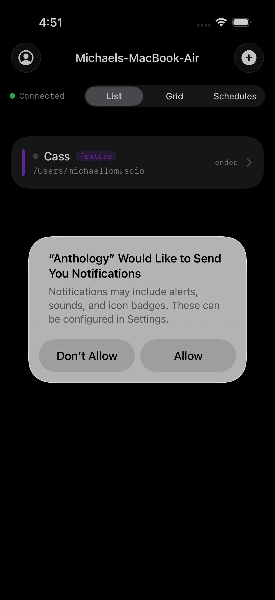
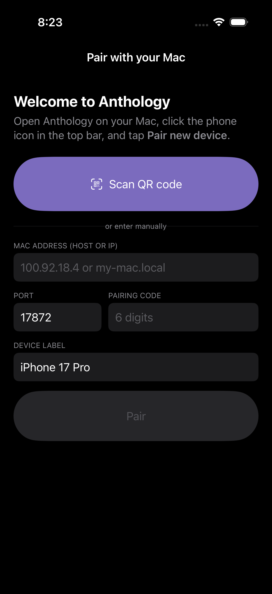
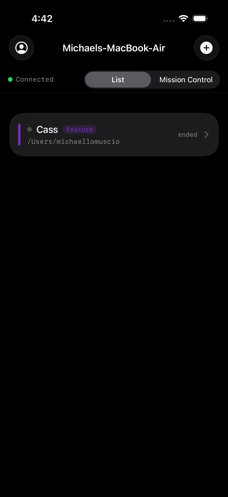

# Anthology iOS

<p>
  <strong>iPhone companion to <a href="https://github.com/michaellomuscio/anthology">Anthology</a> on macOS.</strong>
  View and control Claude Code sessions from your phone — over LAN, Tailscale, or anywhere with internet.
</p>

<p>
  
  
  
  
</p>

The Mac runs a small WebSocket bridge inside Anthology. The iOS app pairs with that bridge once via QR code, stores a long-lived bearer token in Keychain, and from then on streams session output, sends keystrokes back, and gets push-notification alerts when Claude is waiting on a permission decision — even with the app force-closed.

This README is the **complete setup walkthrough**. If you've already paired and just want a quick reference, jump to [Daily use](#daily-use).

---

## Contents

- [Requirements](#requirements)
- [Install on your iPhone](#install-on-your-iphone)
- [First-run pairing](#first-run-pairing)
- [Tabs walkthrough](#tabs-walkthrough)
- [Daily use](#daily-use)
- [Push notifications](#push-notifications)
- [Connecting from outside your home Wi-Fi](#connecting-from-outside-your-home-wi-fi)
- [Settings panel](#settings-panel)
- [Troubleshooting](#troubleshooting)
- [Architecture](#architecture)
- [Building from source](#building-from-source)
- [Companion repos](#companion-repos)

---

## Requirements

| | |
|---|---|
| **Mac** | running Anthology v0.3.0+ ([download](https://github.com/michaellomuscio/anthology/releases/latest)). The Mac app hosts the bridge the iPhone connects to. |
| **iPhone** | iOS 17 or newer. iPad works too. |
| **Apple ID** | the same one used to sign Anthology on the Mac (drlomuscio@icloud.com in this case). Required for TestFlight installs. |
| **Tailscale** *(optional but recommended)* | for use away from your home Wi-Fi. Free, P2P, encrypted with WireGuard. Install the [Tailscale](https://apps.apple.com/us/app/tailscale/id1470499037) app on both Mac and iPhone, sign in with the same account, and Anthology Just Works from anywhere. |
| **Cloudflare account** *(optional)* | only if you want push notifications when the iOS app is closed. Setup is documented in [`anthology/docs/SETUP_PUSH.md`](https://github.com/michaellomuscio/anthology/blob/main/docs/SETUP_PUSH.md). |

---

## Install on your iPhone

There are two paths. **TestFlight is the recommended one** — once set up, future updates push to your phone over the air with no USB cable.

### Path A · TestFlight (recommended after first setup)

1. On your iPhone, install **TestFlight** from the App Store (free, made by Apple).
2. The owner of the build (Michael) adds you as an internal tester at [App Store Connect](https://appstoreconnect.apple.com) → **Anthology Console** → **TestFlight** tab.
3. You receive an email titled *"You've been invited to test Anthology Console"* — open it on your iPhone and tap **View in TestFlight**.
4. Tap **Accept**, then **Install**. Anthology appears on your home screen.

Going forward, every new build pushed by the developer triggers a TestFlight notification on your phone offering a one-tap update.

### Path B · Xcode (developer install for active iteration)

If you have the source repo and want the freshest changes without waiting for a TestFlight build:

```bash
git clone https://github.com/michaellomuscio/anthology-ios.git
cd anthology-ios
brew install xcodegen
xcodegen generate
xed .
```

In Xcode:
1. Plug your iPhone in via USB, **Trust This Computer** if prompted.
2. Pick your iPhone in the destination dropdown next to the play button.
3. Click **▶**. Xcode builds, installs, and launches the app.
4. First time only: if the app fails to launch with "Untrusted Developer," go to **Settings → General → VPN & Device Management → tap your developer cert → Trust**.

---

## First-run pairing

Pairing connects your iPhone to one specific Mac and creates a long-lived bearer token that lives in iOS Keychain. The token never leaves the device pair. Revoke any time from the Mac.

### Step 1 — open Anthology on your iPhone

iOS will show two prompts on first launch:

<p align="center">
  
</p>

**Notifications** — tap **Allow**. This lets Anthology wake your phone with a banner when a session goes `waiting` or `error` while the app is closed. (You can change this later in iOS Settings → Notifications → Anthology.)

After dismissing, you land on the pairing screen:

<p align="center">
  
</p>

### Step 2 — get a code from your Mac

On your **Mac**, open Anthology. In the top bar, click the **phone icon** (between the search magnifier and the help **?**). A modal appears with:
- A QR code
- A 6-digit manual code
- A countdown (5 minutes until the code expires)
- The host address your phone should connect to (Tailscale IP if you have it; otherwise LAN IP)

### Step 3 — pair

Two ways. **Pick one.**

#### Option A · Scan the QR (fastest)

In the iOS app, tap **Scan QR code**. Point your iPhone camera at the QR on the Mac screen. Pairing happens automatically; you'll land on the session list within a second.

#### Option B · Manual entry

In the iOS app's pairing form:

| Field | What to enter |
|---|---|
| **Mac address** | the host shown in the Mac modal — `100.92.x.y` if Tailscale is up, or `192.168.x.y` for LAN |
| **Port** | leave at `17872` (default) |
| **Pairing code** | the 6-digit number on the Mac |
| **Device label** | a name for this phone — defaults to your iPhone's name |

Tap **Pair**. You'll land on the session list.

### Step 4 — confirm

You should now see something like:

<p align="center">
  
</p>

Things to verify:
- The title bar shows your **Mac's hostname** (e.g. *Michaels-MacBook-Air*)
- A green dot + "Connected" appear at the top
- Your existing Mac sessions appear as rows

If something's off, jump to [Troubleshooting](#troubleshooting).

---

## Tabs walkthrough

Three tabs across the top, persisted across launches.

### List

Single column of session rows. Each row shows:
- A colored stripe (matches the color you picked when spawning)
- A status dot (running / idle / waiting / error / dead)
- The session name + tag
- The working directory (truncated from the head)
- Status text on the right

Tap a row to open its **Session Detail** — a live SwiftTerm-backed terminal. Type into the keyboard to send keystrokes back to the running Claude session. Pull down to refresh the list manually.

### Mission Control (Grid)

Tile view of every session, adapted for screen width — single column on iPhone portrait, two columns on iPhone landscape or iPad.

Each tile shows the session's color stripe, name, status dot, last 6 lines of recent output (ANSI escapes stripped), and tag/cwd footer. While this tab is visible, the iOS app subscribes to `*` (all sessions) so previews update live. Tap any tile to dive into the full terminal.

### Schedules

CRUD UI for cron + one-shot schedules. Mirrors the Mac's Schedules tab. Each row shows:
- Name + tag
- Cron expression OR one-shot datetime
- Next run time (relative)
- Prompt preview

Swipe right-to-left on a row to **Run now** (green) or **Delete** (red). Tap to open the editor sheet — choose cron vs. one-shot, set cwd, write the prompt, pick color/tag, toggle enabled.

The **+** button (top right) creates a new schedule.

---

## Daily use

After initial pairing, the iOS app is mostly invisible until you need it.

| Want to... | Do... |
|---|---|
| **See what Claude is up to right now** | Open Anthology → Mission Control tab (live tiles) |
| **Type a follow-up into a running session** | Open Anthology → tap the session → tap inside the terminal → type |
| **Spawn a new session from your phone** | Open Anthology → tap **+** (top right of session list) → fill the form → **Spawn** |
| **Kill a session you forgot to end** | Open the session → tap **⋯** (top right) → **Kill session** → confirm |
| **Get notified when Claude needs a permission decision** | Just leave the app closed. iOS will banner you (assuming push is configured — see below) |

Force-quitting the iOS app is fine. The Mac doesn't lose anything; the iOS app just reconnects on next launch using the stored token.

---

## Push notifications

When the app is foregrounded, you see waiting/error transitions in real time via the WebSocket. When the app is backgrounded or closed, iOS suspends the WebSocket — but the Mac can still wake your phone via APNs.

This requires a **one-time setup** of a free Cloudflare Worker on the Mac side. Full walkthrough is in [`SETUP_PUSH.md`](https://github.com/michaellomuscio/anthology/blob/main/docs/SETUP_PUSH.md) in the Mac repo. ~15 min total. Cost: $0/month.

What you'll see after setup:
- The Mac's pairing modal shows your iPhone with a `push` badge
- A `waiting` or `error` transition fires a banner on your phone:
  > **auth-rewrite needs you**
  > *Claude is waiting on a permission decision.*
- Tap the banner → app opens straight to that session

---

## Connecting from outside your home Wi-Fi

Three options, in order of recommendation:

### 1. Tailscale (recommended)

[Tailscale](https://tailscale.com) gives both your Mac and your iPhone a private IP on a WireGuard mesh. Install on both, sign in with the same account once, then connect to your Mac's Tailscale IP (`100.x.y.z`) from anywhere. End-to-end encrypted, peer-to-peer, free for personal use, no public IPs exposed.

The Mac's pairing modal labels your Tailscale IP as **"Tailscale"** so you know which to scan/type.

### 2. Cellular hotspot to your Mac

If both devices are tethered through the same hotspot, you're effectively on the same LAN.

### 3. Cloudflare Tunnel (advanced)

Possible to expose Anthology's bridge via a Cloudflare tunnel, but the bearer token is the only thing standing between the public internet and your Mac. Not recommended unless you're comfortable hardening it.

---

## Settings panel

Tap the **person icon** (top left of session list) to open Settings.

| Section | Shows |
|---|---|
| **Connected Mac** | hostname, address, server version, current connection state (Connected / Reconnecting / etc.) |
| **Push notifications** | iOS permission status, first 10 chars of your APNs device token (so you can verify against the Mac's `bridge-tokens.json`), `Request notification permission` button if you previously denied |
| **About** | app version, bridge protocol version |
| **Forget this Mac** | revokes the local token and pops you back to pairing. Note: the Mac still remembers this device until you also revoke from the Mac's pairing modal |

---

## Troubleshooting

<details>
<summary><strong>Pairing fails with "Wrong pairing code."</strong></summary>

The 6-digit code is single-use. If you accidentally tried it twice, generate a fresh one: on the Mac, click the phone icon → **Cancel pairing**, then **Pair new device**.
</details>

<details>
<summary><strong>Pairing fails with "No active pairing on the Mac."</strong></summary>

You haven't clicked **Pair new device** on the Mac yet (or the previous code expired after 5 min).
</details>

<details>
<summary><strong>Pairing succeeds but the session list shows "Disconnected."</strong></summary>

Most common cause: the iOS device can't actually reach the Mac on `host:17872`. Check:
- If you used the LAN IP, both devices need to be on the same Wi-Fi
- If you used the Tailscale IP, both Tailscale apps need to be **enabled** (the toggle in the Tailscale app)
- Your Mac firewall might be blocking port 17872 — System Settings → Network → Firewall → check Anthology is allowed
</details>

<details>
<summary><strong>I see sessions but tapping one shows a blank black screen.</strong></summary>

Usually a slow first connection — give it 1-2 seconds for the buffer snapshot to arrive. If still blank after 5 seconds, pull down to refresh, or kill the app from the multitasking switcher and reopen.
</details>

<details>
<summary><strong>The Kill button doesn't actually kill the session.</strong></summary>

Make sure your Mac is on Anthology v0.3.0+ — earlier versions had a bug where SIGKILL escalation never fired. Check Anthology → app menu → About.
</details>

<details>
<summary><strong>Push notifications don't fire when the app is closed.</strong></summary>

Two things to check:
1. **iOS permission**: Settings (iOS) → Notifications → Anthology → Allow Notifications must be on
2. **Mac configuration**: Anthology Mac → phone icon → "Push relay" panel must show **Configured**. Setup walkthrough is in `anthology/docs/SETUP_PUSH.md`.
</details>

<details>
<summary><strong>I lost my phone / want to revoke a device's access.</strong></summary>

On the Mac: phone icon → in the **Paired devices** list, tap **Revoke** next to the device. The token is invalidated immediately; if there's an active WebSocket connection from that token, it's force-closed.
</details>

---

## Architecture

```
┌─────────────────────────────────────────────────────────┐
│  iPhone                                                  │
│                                                          │
│  ┌──────────────┐  ┌──────────────┐  ┌────────────────┐  │
│  │ PairingView  │  │ SessionList/ │  │  SchedulesView │  │
│  │ (QR + manual)│  │ MissionCtrl/ │  │  + editor      │  │
│  │              │  │ Detail (Term)│  │                │  │
│  └──────────────┘  └───────┬──────┘  └────────────────┘  │
│                            │                              │
│  ┌─────────────────────────┴─────────────────────────┐   │
│  │ BridgeStore (@MainActor ObservableObject)         │   │
│  │   ↳ BridgeClient: URLSessionWebSocketTask        │   │
│  │     · request/response by id                      │   │
│  │     · 30s heartbeat                               │   │
│  │     · exp-backoff reconnect                       │   │
│  └────────────────────────┬──────────────────────────┘   │
│                            │                              │
│  ┌─────────────────────────┴────────┐  ┌──────────────┐  │
│  │ KeychainStore (token)            │  │ PushManager  │  │
│  │ ServerStore (UserDefaults)       │  │ (APNs)       │  │
│  └──────────────────────────────────┘  └──────────────┘  │
└────────────────────────────────────────────────────────┬─┘
                                                         │
                       ws://<host>:17872/ws              │
                       Authorization: Bearer ant_…        │
                                                         │
┌────────────────────────────────────────────────────────┴─┐
│  Mac (Anthology)                                         │
│   bridge-server.js · bridge-tokens.js · push-dispatcher  │
│   ptyManager · sessionsStore · scheduler                 │
└──────────────────────────────────────────────────────────┘
```

Source layout (under `Anthology/`):

```
Models/
  SessionMeta.swift       Codable mirror of bridge SessionMeta
  Schedule.swift          cron + one-shot
  PairingResponse.swift   /pair response + URL parser
  BridgeMessage.swift     OutboundMessage / InboundMessage / AnyCodable
  Constants.swift         SESSION_COLORS / TAGS, Color(hex:)

Networking/
  BridgeClient.swift      WS task wrapper, request/response, heartbeat, reconnect
  BridgeStore.swift       @MainActor ObservableObject for SwiftUI
  PairingClient.swift     POST /pair
  PushManager.swift       APNs registration + register_push_token

Storage/
  KeychainStore.swift     bearer token, kSecAttrAccessibleAfterFirstUnlockThisDeviceOnly
  ServerStore.swift       paired Mac metadata in UserDefaults

Views/
  ContentView.swift       router (PairingView ↔ SessionListView)
  PairingView.swift       QR + manual form
  QRScannerView.swift     AVFoundation camera
  SessionListView.swift   List/Grid/Schedules switcher + toolbar
  SessionDetailView.swift status bar + terminal + send-prompt + kill
  TerminalContainerView.swift  SwiftTerm wrapper
  MissionControlView.swift     LazyVGrid of tiles
  SpawnView.swift              modal sheet with color/tag picker
  SchedulesView.swift          CRUD list
  ScheduleEditorView.swift     cron / one-shot editor
  SettingsView.swift           connection + push status
  StatusDot.swift              pulsing dot for running state
```

The Xcode project is **regenerated from `project.yml`** by [XcodeGen](https://github.com/yonaskolb/XcodeGen). The `.xcodeproj` is gitignored.

---

## Building from source

```bash
git clone https://github.com/michaellomuscio/anthology-ios.git
cd anthology-ios
brew install xcodegen
xcodegen generate
xed .
```

Or from the command line:

```bash
xcodebuild -project Anthology.xcodeproj \
  -scheme Anthology \
  -destination 'platform=iOS Simulator,name=iPhone 17 Pro' \
  -configuration Debug build
```

For TestFlight / App Store distribution: open in Xcode → set destination to **Any iOS Device (arm64)** → **Product → Archive** → **Distribute App → TestFlight (Internal testing only) → Upload**. The Release entitlement (`aps-environment: production`) is wired automatically per build configuration.

---

## Companion repos

| | |
|---|---|
| 🖥 **[anthology](https://github.com/michaellomuscio/anthology)** | The Mac app this companion talks to. Hosts the WebSocket bridge, the pairing UI, and the push dispatcher. |
| ☁️ **[anthology-push-worker](https://github.com/michaellomuscio/anthology-push-worker)** | The ~150-line Cloudflare Worker that signs APNs JWTs and forwards push alerts. Free tier; deploys with `wrangler deploy`. |

---

## License

Copyright © 2026 Michael Lomuscio. All rights reserved. Distributed privately to invited collaborators.
